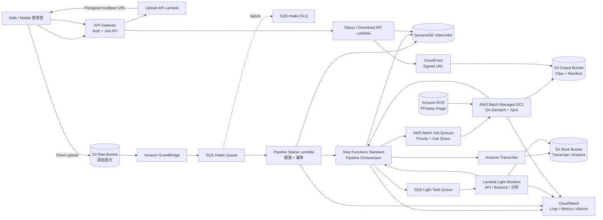

## 建議結論

依照目前 GitHub issue 的目標，系統是「影片上傳完成後，自動執行 Transcribe → 分析 → 裁切 → 回存 S3」，而 A1 與 A3 已被定義成分析組與系統組之間的介面契約。

我建議採用：

> **S3 + EventBridge + SQS + Step Functions Standard + Lambda 輕量工作池 + AWS Batch/EC2 FFmpeg 重量工作池 + DynamoDB 狀態表 + S3/CloudFront 下載**

不要讓 S3 直接觸發 FFmpeg Lambda 或 EC2 worker。S3 事件可能重複傳遞，因此入口必須具備佇列、冪等性與背壓控制。AWS 官方也明確說明 S3 Event Notifications 是至少傳遞一次。([AWS 文檔][1])

本設計目前假設你們的「即時」是：

**影片完成上傳後，數秒內開始處理的近即時非同步 pipeline。**

不是直播進行中逐段收流、逐段分析與剪輯。

---

# 1. 企業級參考架構



---

# 2. 各層服務選型

## 上傳入口

使用者先向 API 申請 `job_id` 與 S3 presigned multipart upload URL，然後直接上傳至 S3，不讓影片流量經過 API Gateway 或 Lambda。

Presigned URL 能讓使用者在沒有 AWS 憑證的情況下，對指定 S3 object 執行有限時間的上傳或下載，也能搭配 checksum 驗證完整性。([AWS 文檔][2])

建議流程：

1. `POST /jobs`
2. 建立 DynamoDB Job
3. 回傳 `job_id`、S3 object key、multipart upload 資訊
4. 前端直接上傳 S3
5. S3 完成 `CompleteMultipartUpload`
6. 觸發 pipeline

---

## Pipeline 事件入口

推薦：

```text
S3 Object Created
  → EventBridge rule
  → SQS Intake Queue
  → Pipeline Starter Lambda
  → Step Functions Standard
```

EventBridge 負責事件篩選與路由，例如只接受：

```text
bucket = raw bucket
prefix = tenants/*/jobs/*/input/
suffix = .mp4 | .mov | .mkv
```

SQS 負責吸收同時間大量上傳，避免瞬間啟動大量 Lambda、Transcribe 或 Batch jobs。

SQS 的 Lambda event source 可以設定最大併發，避免某個 queue 耗盡整個帳號的 Lambda concurrency；Lambda reserved concurrency 也能用來限制下游壓力。([AWS 文檔][3])

---

## 工作流編排

使用 **Step Functions Standard**，不建議把整個 pipeline 寫在一個 Lambda 中。

Standard Workflow 適合長時間、可稽核的工作流，最長可執行一年，並提供 exactly-once workflow execution；Express Workflow 最長只有五分鐘，也不支援 Batch `.sync` 與 callback integration。([AWS 文檔][4])

建議 state machine：

```text
ValidateInput
   ↓
CreateOrConfirmJob
   ↓
StartTranscription
   ↓
WaitTranscription
   ↓
NormalizeTranscript
   ↓
AnalyzeHighlights
   ↓
ValidateHighlights
   ↓
Map Each Highlight
   ├─ RenderClip 1
   ├─ RenderClip 2
   └─ RenderClip N
   ↓
GenerateManifest
   ↓
MarkJobSucceeded
   ↓
NotifyUser
```

每個 state 都應具備：

* Timeout
* Retry with exponential backoff
* Catch
* 錯誤碼標準化
* DynamoDB stage 狀態更新
* Correlation ID／job ID

---

## Transcribe 等待方式

Amazon Transcribe 完成或失敗時可以發出 EventBridge 事件，但官方說明這些事件是 best-effort delivery。([AWS 文檔][5])

因此建議分兩階段：

### MVP

使用 Step Functions：

```text
StartTranscriptionJob
→ Wait 15–30 秒
→ GetTranscriptionJob
→ COMPLETED / FAILED / 繼續等待
```

優點是容易完成，也不依賴事件一定抵達。

### 企業版

使用 callback pattern：

```text
Step Functions task token
→ Start Transcribe
→ 將 task token + transcriptionJobName 寫入 DynamoDB
→ EventBridge 收到完成事件
→ Callback Lambda 呼叫 SendTaskSuccess / SendTaskFailure
```

另外增加一個定期 reconciliation job，查找長時間停在 `TRANSCRIBING` 的工作，補查 Transcribe 狀態，以防完成事件未送達。

---

# 3. Light 與 Heavy Worker 分流

## Light task

適用：

* 呼叫 Bedrock
* 呼叫外部 API
* Transcript 正規化
* JSON schema 驗證
* Highlights 後處理
* 產生 manifest
* 小型 metadata 操作

執行環境：

```text
SQS Light Task Queue
→ Lambda
→ Step Functions callback
```

建議按照 API 類型拆 queue：

```text
light-analysis-queue
external-api-queue
notification-queue
```

每個 queue 分別設定：

* Maximum concurrency
* Reserved concurrency
* Batch size
* Visibility timeout
* Retry 次數
* DLQ

這樣外部 API 限流時，不會阻塞其他 Lambda 任務。

---

## Heavy task

適用：

* FFmpeg 影片裁切
* Transcoding
* Burn-in subtitle
* 多輸出解析度
* 複雜 filter graph
* 長影片
* GPU 編碼

推薦：

```text
Step Functions
→ AWS Batch SubmitJob.sync
→ Batch Job Queue
→ Managed EC2 Compute Environment
→ FFmpeg container
```

Step Functions 原生支援提交 AWS Batch job 並等待完成的 `.sync` integration。([AWS 文檔][6])

AWS Batch 可管理 EC2 On-Demand、EC2 Spot、Fargate 或 Fargate Spot compute environments，也會管理 Auto Scaling Group、ECS Cluster 與 Spot capacity。([AWS 文檔][7])

### 建議的 Batch queues

| Queue             | 優先權 | Compute Environment | 用途             |
| ----------------- | --: | ------------------- | -------------- |
| `render-critical` | 100 | On-Demand           | Demo、付費／高優先使用者 |
| `render-standard` |  50 | On-Demand + Spot    | 一般短片           |
| `render-bulk`     |  10 | Spot                | 大量離線或可重試任務     |

多租戶情境可以使用 Batch fair-share scheduling，避免單一 tenant 佔滿所有 compute capacity。([AWS 文檔][8])

### 為何不以 Lambda 執行主要 FFmpeg

Lambda 的單次執行時間上限為 900 秒，也就是 15 分鐘；影片下載、處理複雜度與資料量都容易造成 timeout。([AWS 文檔][9])

Lambda 可以保留給：

* 很短的測試素材
* Thumbnail
* Probe metadata
* 幾十秒的小片段
* Hackathon fallback

主要 FFmpeg rendering 應使用 Batch/EC2。

### MediaConvert 選項

若需求只包含標準 codec、解析度轉換與基本時間裁切，可考慮 MediaConvert，降低 FFmpeg image、AMI 與 scaling 的維運負擔。

若需要：

* 自訂 FFmpeg filter
* 特殊字幕或 overlay
* 特殊 codec
* 自訂模型／二進位
* 完整控制 command line

則維持 AWS Batch + FFmpeg。

---

# 4. 高併發與背壓設計

高併發不是單純增加 Lambda concurrency，而是逐層限制與緩衝。

## 第一層：上傳隔離

影片直接上傳 S3，API 只處理 metadata，因此 API 不會承受影片頻寬。

## 第二層：SQS Intake Queue

所有 S3 events 先排隊。

設定：

```text
Visibility timeout > Starter Lambda timeout × 6
Maximum receive count = 5
DLQ retention = 14 days
```

## 第三層：冪等 Pipeline Starter

以以下資訊產生 `idempotency_key`：

```text
bucket + key + version_id
```

若未啟用 S3 Versioning：

```text
bucket + key + content_sha256
```

Starter 使用 DynamoDB conditional put：

```text
attribute_not_exists(PK)
```

只有第一個事件能建立工作，其餘重複事件直接視為已處理。DynamoDB 的 condition expression 可避免相同 primary key 被覆寫。([AWS 文檔][10])

Step Functions execution name 也使用固定值：

```text
video-{job_id}-{pipeline_version}
```

如此即使 Lambda 在啟動工作流後失敗、SQS 再次投遞，也不會再建立第二條相同 execution。

## 第四層：任務類型分流

```text
Light queue → Lambda concurrency
Heavy queue → Batch vCPU capacity
External API queue → API rate limit
```

不要讓 heavy job 與 API call 共用同一個 queue。

## 第五層：Batch 容量

Batch queue 保存等待中的工作，直到 compute environment 有足夠容量才執行。Batch 也支援使用不同優先權 queue 對應 On-Demand 或 Spot capacity。([AWS 文檔][11])

## 第六層：租戶限額

DynamoDB Job item 建議保存：

```text
tenant_id
priority
max_parallel_clips
processing_class
```

Step Functions `Map.MaxConcurrency` 依方案設定：

```text
free:       1
standard:   3
premium:   10
internal:   20
```

實際數字應根據 Batch vCPU quota、影片大小及 SLA 壓測後決定。

---

# 5. S3 儲存分配

## 推薦：三個 Bucket

```text
video-raw-{env}
video-work-{env}
video-output-{env}
```

分 Bucket 能降低 IAM 複雜度，也避免輸出檔再次觸發輸入 pipeline。AWS 官方也警告，若 Lambda 將輸出寫回相同觸發 bucket，可能形成循環，建議使用不同 bucket 或嚴格限制 trigger prefix。([AWS 文檔][1])

Hackathon MVP 若要簡化，也可以使用單一 bucket，但事件只能監聽：

```text
input/
```

不能監聽整個 bucket。

## 建議 Key Schema

```text
s3://video-raw-{env}/
  tenant={tenant_id}/
    job={job_id}/
      input/
        source.{extension}
      metadata/
        upload.json
```

```text
s3://video-work-{env}/
  tenant={tenant_id}/
    job={job_id}/
      transcripts/
        raw/
          transcribe.json
        normalized/
          v1/
            transcript.json

      analysis/
        v1/
          highlights.json

      render/
        v1/
          clip={clip_id}/
            request.json
            ffmpeg.log
```

```text
s3://video-output-{env}/
  tenant={tenant_id}/
    job={job_id}/
      clips/
        v1/
          {clip_id}.mp4
      thumbnails/
        {clip_id}.jpg
      manifests/
        result.json
```

## S3 object metadata／tags

每個主要 object 建議保存：

```text
job-id
tenant-id
schema-version
pipeline-version
content-sha256
retention-class
created-by
```

## Lifecycle 建議

| 資料                   |             建議保存 |
| -------------------- | ---------------: |
| Upload 未完成 multipart |           1 天後清除 |
| Work 中間檔             |           7–14 天 |
| FFmpeg 暫存／log        |              7 天 |
| 原始影片                 | 依產品需求，例如 30–90 天 |
| Transcript／analysis  |          依資料治理需求 |
| Output clips         |          使用者方案決定 |
| Failed job artifacts |          14–30 天 |

所有 bucket：

* Block Public Access
* SSE-KMS
* Versioning
* Bucket owner enforced
* Lifecycle rules
* TLS-only bucket policy

---

# 6. DynamoDB Table Schema

建議使用一張 `VideoJobs` single table。

## Primary key

```text
PK: string
SK: string
```

## Job metadata item

```text
PK = JOB#{job_id}
SK = META
```

主要欄位：

| 欄位                    | 型別     | 用途                       |
| --------------------- | ------ | ------------------------ |
| `job_id`              | String | 工作識別碼                    |
| `tenant_id`           | String | 租戶                       |
| `user_id`             | String | 建立者                      |
| `status`              | String | 整體狀態                     |
| `current_stage`       | String | 當前階段                     |
| `progress`            | Number | 0–100                    |
| `priority`            | Number | 工作優先權                    |
| `pipeline_version`    | String | Pipeline 版本              |
| `idempotency_key`     | String | 防止重複工作                   |
| `execution_arn`       | String | Step Functions execution |
| `input_bucket`        | String | 原始檔 bucket               |
| `input_key`           | String | 原始檔 key                  |
| `input_version_id`    | String | S3 version               |
| `input_checksum`      | String | 完整性驗證                    |
| `input_size_bytes`    | Number | 檔案大小                     |
| `duration_sec`        | Number | 影片長度                     |
| `output_manifest_key` | String | 最終結果 manifest            |
| `error_code`          | String | 標準錯誤碼                    |
| `error_message`       | String | 最後錯誤                     |
| `created_at`          | String | ISO 8601                 |
| `updated_at`          | String | ISO 8601                 |
| `completed_at`        | String | ISO 8601                 |
| `expires_at`          | Number | DynamoDB TTL             |

## Stage item

```text
PK = JOB#{job_id}
SK = STAGE#{order}#{stage_name}
```

例如：

```text
STAGE#010#VALIDATE
STAGE#020#TRANSCRIBE
STAGE#030#ANALYZE
STAGE#040#RENDER
STAGE#050#FINALIZE
```

欄位：

```text
status
service
external_job_id
attempt
started_at
completed_at
input_artifacts
output_artifacts
error_code
error_message
duration_ms
```

## Clip item

```text
PK = JOB#{job_id}
SK = CLIP#{clip_id}
```

欄位：

```text
start_sec
end_sec
duration_sec
score
reason
status
batch_job_id
output_key
thumbnail_key
render_profile
attempt
```

## GSI

### GSI1：列出使用者或 tenant 工作

```text
GSI1PK = TENANT#{tenant_id}
GSI1SK = CREATED#{created_at}#JOB#{job_id}
```

支援：

```text
GET /jobs?tenant_id=...
```

### GSI2：營運查詢

```text
GSI2PK = STATUS#{status}
GSI2SK = UPDATED#{updated_at}#JOB#{job_id}
```

支援：

* 查詢失敗工作
* 找出卡住工作
* 建立 reconciliation job
* 營運 dashboard

---

# 7. Job 狀態機

建議狀態 enum：

```text
CREATED
UPLOAD_PENDING
UPLOADED
QUEUED
VALIDATING
TRANSCRIBING
ANALYZING
RENDERING
FINALIZING
SUCCEEDED
FAILED
CANCEL_REQUESTED
CANCELLED
```

只有以下狀態屬於終止狀態：

```text
SUCCEEDED
FAILED
CANCELLED
```

每次更新使用 optimistic locking：

```text
version = version + 1
ConditionExpression:
  version = :expected_version
```

避免 Transcribe callback、Batch callback 與 reconciliation 同時更新而互相覆蓋。

---

# 8. A1 Transcript Schema

建議不要直接讓分析模組依賴 Amazon Transcribe 原始 JSON。

S4 先保存原始輸出，再正規化成內部契約：

```json
{
  "schema_version": "transcript.v1",
  "job_id": "job_01JXYZ",
  "language_code": "zh-TW",
  "duration_sec": 1834.52,
  "source": {
    "bucket": "video-raw-prod",
    "key": "tenant=t1/job=j1/input/source.mp4",
    "version_id": "abc123"
  },
  "segments": [
    {
      "segment_id": "seg_000001",
      "start_sec": 12.45,
      "end_sec": 18.92,
      "speaker": "spk_0",
      "text": "這是逐字稿內容",
      "confidence": 0.96,
      "items": [
        {
          "type": "pronunciation",
          "start_sec": 12.45,
          "end_sec": 12.83,
          "text": "這是",
          "confidence": 0.97
        }
      ]
    }
  ],
  "created_at": "2026-07-14T10:00:00Z"
}
```

A1 驗收時應包含：

* JSON Schema Draft 2020-12
* 1–2 份 sample
* 空 transcript
* 無 speaker
* 多 speaker
* 缺少 confidence
* 極長 segment
* 非中文素材

這與 issue #4 所要求的 segment、word、時間、文字與選用 speaker 契約一致。

---

# 9. A3 Highlights Schema

```json
{
  "schema_version": "highlights.v1",
  "job_id": "job_01JXYZ",
  "analysis_version": "highlight-model-1.0.0",
  "parameters": {
    "max_clips": 5,
    "min_duration_sec": 15,
    "max_duration_sec": 60,
    "padding_before_sec": 2,
    "padding_after_sec": 3
  },
  "highlights": [
    {
      "clip_id": "clip_001",
      "start_sec": 125.4,
      "end_sec": 168.8,
      "score": 0.91,
      "reason": "觀眾情緒與關鍵內容集中",
      "title": "產品亮點",
      "source_segment_ids": [
        "seg_000041",
        "seg_000042"
      ],
      "render_profile": "vertical-1080x1920"
    }
  ],
  "created_at": "2026-07-14T10:05:00Z"
}
```

裁切規則需明確定義：

```text
0 <= start_sec < end_sec <= video_duration_sec
min_duration <= end_sec - start_sec <= max_duration
padding 後不得超出影片邊界
重疊率超過門檻時合併
相鄰片段間距低於門檻時合併
裁切結果依 score 排序
clip_id 在 job 內唯一
```

這正是 issue #6 要求的 `start_sec`、`end_sec`、`score`、`reason`、時長、合併與 padding 契約。

---

# 10. 使用者下載設計

## MVP

Status API 在工作成功後產生 S3 presigned GET URL：

```text
GET /jobs/{job_id}/artifacts/{clip_id}/download
```

URL 建議有效期：

```text
5–15 分鐘
```

## 企業版

推薦：

```text
Private Output S3
→ CloudFront Origin Access Control
→ CloudFront signed URL
```

CloudFront signed URL 可以限制有效期限，也能透過 custom policy 限制開始時間、結束時間或來源 IP；應用程式驗證使用者權限後才回傳下載 URL。([AWS 文檔][12])

最終 `manifest.json`：

```json
{
  "schema_version": "result.v1",
  "job_id": "job_01JXYZ",
  "status": "SUCCEEDED",
  "clips": [
    {
      "clip_id": "clip_001",
      "key": "tenant=t1/job=j1/clips/v1/clip_001.mp4",
      "duration_sec": 43.4,
      "size_bytes": 12402311,
      "checksum_sha256": "..."
    }
  ]
}
```

不要把永久公開 URL 寫入 DynamoDB，只保存 S3 key；使用者請求下載時才即時產生 signed URL。

---

# 11. 對應目前 Issue 切分

目前 issue 的系統鏈為 S1 架構、S2 S3/IAM、S3 pipeline trigger、S4 Transcribe、S5 分析串接、S6 裁切、S7 E2E 測試。

建議執行順序：

| Wave | Issues      | 主要產出                       |
| ---- | ----------- | -------------------------- |
| 0    | A1、A3、S1、S2 | Schema 契約、架構、S3、IAM、IaC 基礎 |
| 1    | S3、S4、A2    | 上傳觸發、Transcribe、分析邏輯       |
| 2    | S5、A4       | 分析模組串接與離線驗證                |
| 3    | S6          | Batch/FFmpeg 裁切            |
| 4    | S7          | E2E、錯誤情境與壓測                |
| 5    | P1–P7       | 流程圖、簡報、指標、Demo 與備援素材       |

## S1

交付：

* 本架構圖
* 服務選型決策
* MVP 與企業版差異
* 高併發與失敗處理說明

## S2

交付：

* 三 Bucket／單 Bucket MVP 決策
* Prefix schema
* DynamoDB schema
* KMS 與 IAM roles
* Terraform module skeleton

## S3

原驗收中的「S3 → Lambda 編排」建議改成：

```text
S3 → EventBridge → SQS → Starter Lambda → Step Functions
```

保留 Lambda，但 Lambda 只負責安全地啟動工作流，不負責長時間編排。

## S4

交付：

* Transcribe start
* 完成等待策略
* 原始 JSON
* normalized `transcript.v1`
* 失敗與 timeout

## S5

交付：

* `transcript.v1 → highlights.v1`
* Light worker
* JSON schema validation
* API timeout／rate limit handling

## S6

交付：

* ECR FFmpeg image
* Batch job definition
* Batch queues
* Step Functions Map
* Clip output
* Manifest

## S7

除原本的成功案例外，增加：

* 同一影片事件重複送達
* 100 個同時上傳
* Transcribe 失敗
* 分析 API timeout
* FFmpeg exit code 非 0
* Spot interruption
* 單一 clip 失敗
* Pipeline 重跑
* DLQ redrive
* 使用者無權下載其他 tenant 影片

---

# 12. IaC 建議

截至 **2026 年 7 月 14 日**，HashiCorp 官方頁面列出的最新 Terraform 為 **1.15.8**；AWS Provider 最新 release 為 **6.54.0**，兩者皆於 2026 年 7 月 8 日發布。([HashiCorp Developer][13])

建議基線：

```hcl
terraform {
  required_version = "~> 1.15.0"

  required_providers {
    aws = {
      source  = "hashicorp/aws"
      version = "~> 6.54"
    }
  }
}
```

正式 CI 應提交：

```text
.terraform.lock.hcl
```

不要在 production pipeline 使用完全不鎖定的 `latest`。

## Repository 結構

```text
infra/
├── modules/
│   ├── network/
│   ├── storage/
│   ├── dynamodb/
│   ├── eventing/
│   ├── orchestration/
│   ├── lambda-light/
│   ├── batch-heavy/
│   ├── delivery/
│   ├── observability/
│   └── security/
│
├── environments/
│   ├── dev/
│   ├── staging/
│   └── prod/
│
└── policies/
    ├── starter-policy.json
    ├── transcribe-policy.json
    ├── analysis-policy.json
    └── render-policy.json
```

CI/CD：

```text
Pull Request:
terraform fmt
terraform validate
tflint
security scan
terraform test
terraform plan

Main branch:
manual approval
terraform apply
```

GitHub Actions 連 AWS 應使用 OIDC role，不保存長期 access key。

Container image 使用 immutable digest：

```text
ffmpeg-image@sha256:...
```

而不是只使用：

```text
ffmpeg-image:latest
```

---

# 13. P3／S7 建議量測指標

| 指標                               | 用途              |
| -------------------------------- | --------------- |
| Upload-to-pipeline-start p50/p95 | 事件入口延遲          |
| End-to-end success rate          | Pipeline 穩定度    |
| End-to-end latency p50/p95       | 使用者體驗           |
| Processing time / video duration | 處理效率            |
| Transcribe duration              | S4 效能           |
| Analysis duration                | S5 效能           |
| FFmpeg real-time factor          | S6 效能           |
| Queue oldest message age         | 是否容量不足          |
| Batch RUNNABLE job age           | EC2／quota 是否不足  |
| Retry rate                       | 外部服務與 worker 品質 |
| DLQ message count                | 未處理異常           |
| Cost per processed video minute  | 成本成效            |
| Clips produced per job           | 產出品質            |
| Empty highlight rate             | 分析品質            |

建議 Demo 至少展示：

```text
一支正常影片
一支無明顯高光影片
一支故意造成分析失敗的影片
兩至五支同時上傳
```

---

## 最需要先確認的架構決策

目前最大的不確定性是「即時」的定義。

**本方案假設影片上傳完成後才開始處理。若需求是直播過程中邊收流、邊產生逐字稿與短片，S3 upload trigger 將不再是主要入口，整個 pipeline 必須改成串流分段與持續處理架構。**

[1]: https://docs.aws.amazon.com/AmazonS3/latest/userguide/EventNotifications.html "Amazon S3 Event Notifications - Amazon Simple Storage Service"
[2]: https://docs.aws.amazon.com/AmazonS3/latest/userguide/using-presigned-url.html "Download and upload objects with presigned URLs - Amazon Simple Storage Service"
[3]: https://docs.aws.amazon.com/lambda/latest/dg/configuration-concurrency.html "Configuring reserved concurrency for a function - AWS Lambda"
[4]: https://docs.aws.amazon.com/step-functions/latest/dg/choosing-workflow-type.html "Choosing workflow type in Step Functions - AWS Step Functions"
[5]: https://docs.aws.amazon.com/transcribe/latest/dg/monitoring-events.html "Using Amazon EventBridge with Amazon Transcribe - Amazon Transcribe"
[6]: https://docs.aws.amazon.com/step-functions/latest/dg/connect-batch.html "Run AWS Batch workloads with Step Functions - AWS Step Functions"
[7]: https://docs.aws.amazon.com/batch/latest/userguide/managed_compute_environments.html "Managed compute environments - AWS Batch"
[8]: https://docs.aws.amazon.com/batch/latest/userguide/fair-share-scheduling.html "Use fair-share scheduling to help schedule jobs - AWS Batch"
[9]: https://docs.aws.amazon.com/lambda/latest/dg/configuration-timeout.html "Configure Lambda function timeout - AWS Lambda"
[10]: https://docs.aws.amazon.com/amazondynamodb/latest/developerguide/Expressions.ConditionExpressions.html "DynamoDB condition expression CLI example - Amazon DynamoDB"
[11]: https://docs.aws.amazon.com/batch/latest/userguide/job_queues.html "Job queues - AWS Batch"
[12]: https://docs.aws.amazon.com/AmazonCloudFront/latest/DeveloperGuide/private-content-signed-urls.html "Use signed URLs - Amazon CloudFront"
[13]: https://developer.hashicorp.com/terraform/install "Install | Terraform | HashiCorp Developer"
