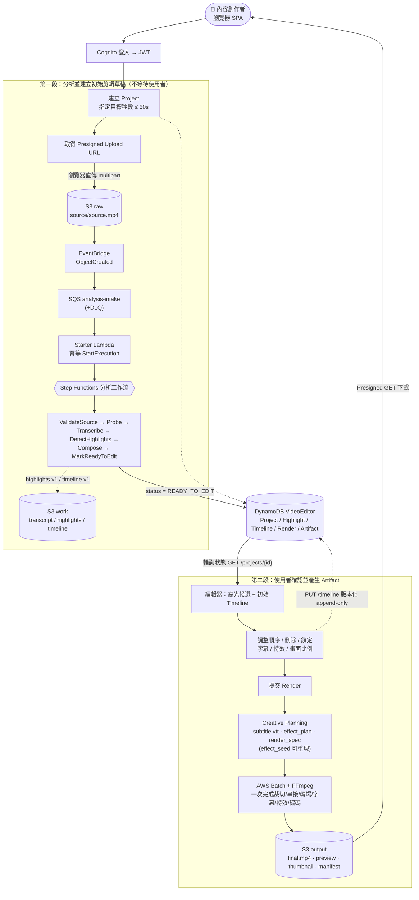
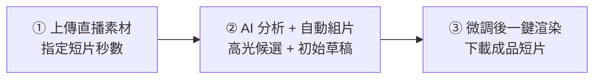

# P1 — 端對端使用者流程圖（#15）

> 驗收：流程涵蓋「輸入直播素材 → AI 分析 → 自動剪輯 → 產出短片」，圖檔可用於簡報 P2。
> 權威來源：`docs/demand.md` §一（兩段式流程）。時間單位一律毫秒（ms）。

## 一句話流程

**上傳直播素材 → AI 自動分析出高光候選並組成初始草稿 →（使用者微調）→ 一次渲染出可下載短片。**

關鍵設計：不是「上傳後一路自動跑到底」，而是**兩段式**——分析先產出「可編輯的草稿」並停在 `READY_TO_EDIT`，使用者回來調整後才觸發渲染。這樣使用者真的有一個「編輯區」，而非只有上傳與等待頁。

---

## 端對端流程圖（可渲染 mermaid）

---

## 對應到願景四平面

| 平面 | 在流程中的角色 | 主要 AWS 服務（現況） |
|------|----------------|----------------------|
| 編輯器控制面 | 登入、建 Project、上傳授權、Timeline、Render 提交、狀態查詢 | CloudFront · Cognito · API Gateway + Lambda |
| 分析處理面 | 轉錄、高光分析、初始組片 | Step Functions · Lambda · Transcribe ·（Bedrock enrich） |
| 重型渲染面 | FFmpeg 裁切/特效/字幕/輸出 | AWS Batch · ECR · FFmpeg 容器 |
| 儲存與交付面 | 原始檔、中間結果、Artifact、下載 | S3（raw/work/output）· DynamoDB · CloudFront |

## 狀態驅動的畫面提示（demand.md §十八）
`CREATED → UPLOADING → ANALYZING → COMPOSING → READY_TO_EDIT → RENDER_REQUESTED → RENDERING → ARTIFACT_READY`
前端每 2–5 秒輪詢 `GET /projects/{id}`，依 status 顯示「正在分析高光／可以開始編輯／正在渲染／影片已完成」。

## 給 P2 簡報用的「三步精簡版」
評審頁面建議只畫三格，細節收進附錄：

